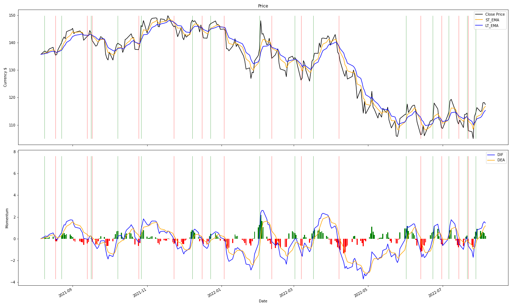

# MACD Primitive Implementation and Tests
## This part of the project implements calcualtion of MACD along with its sub-associated indicators, like EMA, Signal Line, and Gap b/w MACD and Signal in the form of a histogram.
## This project will also include the testings of some popular/customized strategies.
## Belows concepts and formulas are from source: https://www.investopedia.com/

> ## **EMA**  
> Exponential Moving Average, unlike Simple Moving Average (SMA), is a moving average (MA) that places a greater weight and significance on the most recent data points. Traders often use several different EMA lengths, such as 10-day, 50-day, and 200-day moving averages.
> 
> Formula:
> $$EMA_{Today} = Close_{Today} \cdot Multiplier + EMA_{yesterday} \cdot (1-Multiplier)$$
> $$Multiplier = \frac{Smoothing}{1 + Days}$$
>
> *The initial EMA will be a SMA (I use the close price for this project)*  
> *Common choice for Smoothing = 2 gives the most recent observation more weight.*  
> *If the smoothing factor is increased, more recent observations have more influence on the EMA.*

> ## **DIF**  
> The DIF (Difference) is calculated by subtracting the 26-period exponential moving average (EMA) from the 12-period EMA.  
> In order to perform more frequent short-term trading strategy tests, 5-10-5 was used for this project (*5-Day short-term EMA, 10-Day long-term EMA, 5-Day Signal Line*).
> 
> Formula:
> $$DIF = EMA_{short-term} - EMA_{long-term}$$

> ## **DEA/Signal Line**  
> The DEA/signal line (Difference Exponential Average) is commonly a **9-day EMA of the DIF/MACD**. As a moving average of the indicator, it trails the MACD and makes it easier to spot MACD turns.  
> A bullish crossover occurs when the MACD turns up and crosses above the signal line. A bearish crossover occurs when the MACD turns down and crosses below the signal line.

> ## **MACD**  
> Moving average convergence divergence (MACD) is a trend-following momentum indicator that shows the relationship between two moving averages of a security’s price.  
> MACD is often displayed in form of a histogram which graphs the distance between the DIF and DEA.  
> Traders use the MACD’s histogram to identify when bullish or bearish momentum is high.
> 
> Formula:
> $$MACD = DIF - DEA$$

## Golden Cross
short-term moving average crosses over a major long-term moving average to the **upside** and is interpreted by analysts and traders as signaling a definitive **upward turn in a market**
    
## Death Cross
short-term moving average crosses over a major long-term moving average to the **downside** and is understood to signal a decisive **downturn in a market**
    
### problems
> One of the main problems with divergence is that it can often signal a possible reversal but then no actual reversal actually happens—it produces a false positive. The other problem is that divergence doesn't forecast all reversals. In other words, it predicts too many reversals that don't occur and not enough real price reversals. 
> "False positive" divergence often occurs when the price of an asset moves sideways, such as in a range or triangle pattern following a trend.
